# Projects and dependencies analysis

This document provides a comprehensive overview of the projects and their dependencies in the context of upgrading to .NETCoreApp,Version=v11.0.

## Table of Contents

- [Executive Summary](#executive-summary)
  - [Highlevel Metrics](#highlevel-metrics)
  - [Projects Compatibility](#projects-compatibility)
  - [Package Compatibility](#package-compatibility)
  - [API Compatibility](#api-compatibility)
- [Aggregate NuGet packages details](#aggregate-nuget-packages-details)
- [Top API Migration Challenges](#top-api-migration-challenges)
  - [Technologies and Features](#technologies-and-features)
  - [Most Frequent API Issues](#most-frequent-api-issues)
- [Projects Relationship Graph](#projects-relationship-graph)
- [Project Details](#project-details)

  - [MyBlog\src\AppHost\AppHost.csproj](#myblogsrcapphostapphostcsproj)
  - [MyBlog\src\Domain\Domain.csproj](#myblogsrcdomaindomaincsproj)
  - [MyBlog\src\ServiceDefaults\ServiceDefaults.csproj](#myblogsrcservicedefaultsservicedefaultscsproj)
  - [MyBlog\src\Web\Web.csproj](#myblogsrcwebwebcsproj)
  - [MyBlog\tests\AppHost.Tests\AppHost.Tests.csproj](#myblogtestsapphosttestsapphosttestscsproj)
  - [MyBlog\tests\Architecture.Tests\Architecture.Tests.csproj](#myblogtestsarchitecturetestsarchitecturetestscsproj)
  - [MyBlog\tests\Domain.Tests\Domain.Tests.csproj](#myblogtestsdomaintestsdomaintestscsproj)
  - [MyBlog\tests\Web.Tests.Bunit\Web.Tests.Bunit.csproj](#myblogtestswebtestsbunitwebtestsbunitcsproj)
  - [MyBlog\tests\Web.Tests.Integration\Web.Tests.Integration.csproj](#myblogtestswebtestsintegrationwebtestsintegrationcsproj)
  - [MyBlog\tests\Web.Tests\Web.Tests.csproj](#myblogtestswebtestswebtestscsproj)

## Executive Summary

### Highlevel Metrics

| Metric | Count | Status |
| :--- | :---: | :--- |
| Total Projects | 10 | All require upgrade |
| Total NuGet Packages | 37 | 1 need upgrade |
| Total Code Files | 114 |  |
| Total Code Files with Incidents | 22 |  |
| Total Lines of Code | 12153 |  |
| Total Number of Issues | 61 |  |
| Estimated LOC to modify | 50+ | at least 0.4% of codebase |

### Projects Compatibility

| Project | Target Framework | Difficulty | Package Issues | API Issues | Est. LOC Impact | Description |
| :--- | :---: | :---: | :---: | :---: | :---: | :--- |
| [MyBlog\src\AppHost\AppHost.csproj](#myblogsrcapphostapphostcsproj) | net10.0 | 🟢 Low | 0 | 0 |  | DotNetCoreApp, Sdk Style = True |
| [MyBlog\src\Domain\Domain.csproj](#myblogsrcdomaindomaincsproj) | net10.0 | 🟢 Low | 0 | 0 |  | ClassLibrary, Sdk Style = True |
| [MyBlog\src\ServiceDefaults\ServiceDefaults.csproj](#myblogsrcservicedefaultsservicedefaultscsproj) | net10.0 | 🟢 Low | 0 | 0 |  | ClassLibrary, Sdk Style = True |
| [MyBlog\src\Web\Web.csproj](#myblogsrcwebwebcsproj) | net10.0 | 🟢 Low | 1 | 18 | 18+ | AspNetCore, Sdk Style = True |
| [MyBlog\tests\AppHost.Tests\AppHost.Tests.csproj](#myblogtestsapphosttestsapphosttestscsproj) | net10.0 | 🟢 Low | 0 | 21 | 21+ | DotNetCoreApp, Sdk Style = True |
| [MyBlog\tests\Architecture.Tests\Architecture.Tests.csproj](#myblogtestsarchitecturetestsarchitecturetestscsproj) | net10.0 | 🟢 Low | 0 | 0 |  | DotNetCoreApp, Sdk Style = True |
| [MyBlog\tests\Domain.Tests\Domain.Tests.csproj](#myblogtestsdomaintestsdomaintestscsproj) | net10.0 | 🟢 Low | 0 | 0 |  | DotNetCoreApp, Sdk Style = True |
| [MyBlog\tests\Web.Tests.Bunit\Web.Tests.Bunit.csproj](#myblogtestswebtestsbunitwebtestsbunitcsproj) | net10.0 | 🟢 Low | 0 | 0 |  | DotNetCoreApp, Sdk Style = True |
| [MyBlog\tests\Web.Tests.Integration\Web.Tests.Integration.csproj](#myblogtestswebtestsintegrationwebtestsintegrationcsproj) | net10.0 | 🟢 Low | 0 | 0 |  | DotNetCoreApp, Sdk Style = True |
| [MyBlog\tests\Web.Tests\Web.Tests.csproj](#myblogtestswebtestswebtestscsproj) | net10.0 | 🟢 Low | 0 | 11 | 11+ | DotNetCoreApp, Sdk Style = True |

### Package Compatibility

| Status | Count | Percentage |
| :--- | :---: | :---: |
| ✅ Compatible | 36 | 97.3% |
| ⚠️ Incompatible | 1 | 2.7% |
| 🔄 Upgrade Recommended | 0 | 0.0% |
| ***Total NuGet Packages*** | ***37*** | ***100%*** |

### API Compatibility

| Category | Count | Impact |
| :--- | :---: | :--- |
| 🔴 Binary Incompatible | 1 | High - Require code changes |
| 🟡 Source Incompatible | 15 | Medium - Needs re-compilation and potential conflicting API error fixing |
| 🔵 Behavioral change | 34 | Low - Behavioral changes that may require testing at runtime |
| ✅ Compatible | 19771 |  |
| ***Total APIs Analyzed*** | ***19821*** |  |

## Aggregate NuGet packages details

| Package | Current Version | Suggested Version | Projects | Description |
| :--- | :---: | :---: | :--- | :--- |
| Aspire.Hosting.MongoDB | 13.3.0 |  | [AppHost.csproj](#myblogsrcapphostapphostcsproj) | ✅Compatible |
| Aspire.Hosting.Redis | 13.3.0 |  | [AppHost.csproj](#myblogsrcapphostapphostcsproj) | ✅Compatible |
| Aspire.Hosting.Testing | 13.3.0 |  | [AppHost.Tests.csproj](#myblogtestsapphosttestsapphosttestscsproj) [Web.Tests.Integration.csproj](#myblogtestswebtestsintegrationwebtestsintegrationcsproj) | ✅Compatible |
| Aspire.MongoDB.Driver | 13.3.0 |  | [Web.csproj](#myblogsrcwebwebcsproj) | ✅Compatible |
| Aspire.StackExchange.Redis.DistributedCaching | 13.3.0 |  | [Web.csproj](#myblogsrcwebwebcsproj) | ✅Compatible |
| Auth0.AspNetCore.Authentication | 1.7.0 |  | [Web.csproj](#myblogsrcwebwebcsproj) | ✅Compatible |
| Auth0.ManagementApi | 8.2.0 |  | [Web.csproj](#myblogsrcwebwebcsproj) | ✅Compatible |
| bunit | 2.7.2 |  | [Web.Tests.Bunit.csproj](#myblogtestswebtestsbunitwebtestsbunitcsproj) | ✅Compatible |
| coverlet.collector | 10.0.0 |  | [AppHost.Tests.csproj](#myblogtestsapphosttestsapphosttestscsproj) [Architecture.Tests.csproj](#myblogtestsarchitecturetestsarchitecturetestscsproj) [Domain.Tests.csproj](#myblogtestsdomaintestsdomaintestscsproj) [Web.Tests.Bunit.csproj](#myblogtestswebtestsbunitwebtestsbunitcsproj) [Web.Tests.csproj](#myblogtestswebtestswebtestscsproj) [Web.Tests.Integration.csproj](#myblogtestswebtestsintegrationwebtestsintegrationcsproj) | ✅Compatible |
| coverlet.msbuild | 10.0.0 |  | [Web.Tests.Bunit.csproj](#myblogtestswebtestsbunitwebtestsbunitcsproj) | ✅Compatible |
| FluentAssertions | 8.10.0 |  | [AppHost.Tests.csproj](#myblogtestsapphosttestsapphosttestscsproj) [Architecture.Tests.csproj](#myblogtestsarchitecturetestsarchitecturetestscsproj) [Domain.Tests.csproj](#myblogtestsdomaintestsdomaintestscsproj) [Web.Tests.Bunit.csproj](#myblogtestswebtestsbunitwebtestsbunitcsproj) [Web.Tests.csproj](#myblogtestswebtestswebtestscsproj) [Web.Tests.Integration.csproj](#myblogtestswebtestsintegrationwebtestsintegrationcsproj) | ✅Compatible |
| FluentValidation | 12.1.1 |  | [Domain.csproj](#myblogsrcdomaindomaincsproj) [Domain.Tests.csproj](#myblogtestsdomaintestsdomaintestscsproj) [Web.Tests.csproj](#myblogtestswebtestswebtestscsproj) | ✅Compatible |
| FluentValidation.AspNetCore | 11.3.1 |  | [Web.csproj](#myblogsrcwebwebcsproj) | ⚠️NuGet package is deprecated |
| FluentValidation.DependencyInjectionExtensions | 12.1.1 |  | [Web.csproj](#myblogsrcwebwebcsproj) | ✅Compatible |
| HtmlSanitizer | 9.1.923-beta |  | [Web.csproj](#myblogsrcwebwebcsproj) | ✅Compatible |
| MediatR | 14.1.0 |  | [Domain.csproj](#myblogsrcdomaindomaincsproj) [Domain.Tests.csproj](#myblogtestsdomaintestsdomaintestscsproj) [Web.csproj](#myblogsrcwebwebcsproj) | ✅Compatible |
| Microsoft.Bcl.AsyncInterfaces | 10.0.7 |  | [Web.csproj](#myblogsrcwebwebcsproj) | ✅Compatible |
| Microsoft.Extensions.Http.Resilience | 10.5.0 |  | [ServiceDefaults.csproj](#myblogsrcservicedefaultsservicedefaultscsproj) | ✅Compatible |
| Microsoft.Extensions.ServiceDiscovery | 10.5.0 |  | [ServiceDefaults.csproj](#myblogsrcservicedefaultsservicedefaultscsproj) | ✅Compatible |
| Microsoft.NET.Test.Sdk | 18.5.1 |  | [AppHost.Tests.csproj](#myblogtestsapphosttestsapphosttestscsproj) [Architecture.Tests.csproj](#myblogtestsarchitecturetestsarchitecturetestscsproj) [Domain.Tests.csproj](#myblogtestsdomaintestsdomaintestscsproj) [Web.Tests.Bunit.csproj](#myblogtestswebtestsbunitwebtestsbunitcsproj) [Web.Tests.csproj](#myblogtestswebtestswebtestscsproj) [Web.Tests.Integration.csproj](#myblogtestswebtestsintegrationwebtestsintegrationcsproj) | ✅Compatible |
| Microsoft.Playwright | 1.59.0 |  | [AppHost.Tests.csproj](#myblogtestsapphosttestsapphosttestscsproj) | ✅Compatible |
| MongoDB.Driver | 3.8.1 |  | [AppHost.Tests.csproj](#myblogtestsapphosttestsapphosttestscsproj) | ✅Compatible |
| MongoDB.EntityFrameworkCore | 10.0.1 |  | [Web.csproj](#myblogsrcwebwebcsproj) | ✅Compatible |
| NetArchTest.Rules | 1.3.2 |  | [Architecture.Tests.csproj](#myblogtestsarchitecturetestsarchitecturetestscsproj) | ✅Compatible |
| NSubstitute | 5.3.0 |  | [Domain.Tests.csproj](#myblogtestsdomaintestsdomaintestscsproj) [Web.Tests.Bunit.csproj](#myblogtestswebtestsbunitwebtestsbunitcsproj) [Web.Tests.csproj](#myblogtestswebtestswebtestscsproj) [Web.Tests.Integration.csproj](#myblogtestswebtestsintegrationwebtestsintegrationcsproj) | ✅Compatible |
| OpenTelemetry.Exporter.OpenTelemetryProtocol | 1.15.3 |  | [ServiceDefaults.csproj](#myblogsrcservicedefaultsservicedefaultscsproj) | ✅Compatible |
| OpenTelemetry.Extensions.Hosting | 1.15.3 |  | [ServiceDefaults.csproj](#myblogsrcservicedefaultsservicedefaultscsproj) | ✅Compatible |
| OpenTelemetry.Instrumentation.AspNetCore | 1.15.2 |  | [ServiceDefaults.csproj](#myblogsrcservicedefaultsservicedefaultscsproj) | ✅Compatible |
| OpenTelemetry.Instrumentation.Http | 1.15.1 |  | [ServiceDefaults.csproj](#myblogsrcservicedefaultsservicedefaultscsproj) | ✅Compatible |
| OpenTelemetry.Instrumentation.Runtime | 1.15.1 |  | [ServiceDefaults.csproj](#myblogsrcservicedefaultsservicedefaultscsproj) | ✅Compatible |
| RTBlazorfied | 2.0.20 |  | [Web.csproj](#myblogsrcwebwebcsproj) | ✅Compatible |
| Snappier | 1.3.1 |  | [AppHost.csproj](#myblogsrcapphostapphostcsproj) [Web.csproj](#myblogsrcwebwebcsproj) | ✅Compatible |
| Testcontainers.MongoDb | 4.11.0 |  | [Web.Tests.Integration.csproj](#myblogtestswebtestsintegrationwebtestsintegrationcsproj) | ✅Compatible |
| Testcontainers.Redis | 4.11.0 |  | [Web.Tests.Integration.csproj](#myblogtestswebtestsintegrationwebtestsintegrationcsproj) | ✅Compatible |
| xunit.analyzers | 1.27.0 |  | [Architecture.Tests.csproj](#myblogtestsarchitecturetestsarchitecturetestscsproj) | ✅Compatible |
| xunit.runner.visualstudio | 3.1.5 |  | [AppHost.Tests.csproj](#myblogtestsapphosttestsapphosttestscsproj) [Architecture.Tests.csproj](#myblogtestsarchitecturetestsarchitecturetestscsproj) [Domain.Tests.csproj](#myblogtestsdomaintestsdomaintestscsproj) [Web.Tests.Bunit.csproj](#myblogtestswebtestsbunitwebtestsbunitcsproj) [Web.Tests.csproj](#myblogtestswebtestswebtestscsproj) [Web.Tests.Integration.csproj](#myblogtestswebtestsintegrationwebtestsintegrationcsproj) | ✅Compatible |
| xunit.v3 | 3.2.2 |  | [AppHost.Tests.csproj](#myblogtestsapphosttestsapphosttestscsproj) [Architecture.Tests.csproj](#myblogtestsarchitecturetestsarchitecturetestscsproj) [Domain.Tests.csproj](#myblogtestsdomaintestsdomaintestscsproj) [Web.Tests.Bunit.csproj](#myblogtestswebtestsbunitwebtestsbunitcsproj) [Web.Tests.csproj](#myblogtestswebtestswebtestscsproj) [Web.Tests.Integration.csproj](#myblogtestswebtestsintegrationwebtestsintegrationcsproj) | ✅Compatible |

## Top API Migration Challenges

### Technologies and Features

| Technology | Issues | Percentage | Migration Path |
| :--- | :---: | :---: | :--- |

### Most Frequent API Issues

| API | Count | Percentage | Category |
| :--- | :---: | :---: | :--- |
| T:System.Uri | 17 | 34.0% | Behavioral Change |
| T:System.Text.Json.JsonDocument | 8 | 16.0% | Behavioral Change |
| M:System.TimeSpan.FromSeconds(System.Int64) | 6 | 12.0% | Source Incompatible |
| M:System.Environment.SetEnvironmentVariable(System.String,System.String) | 2 | 4.0% | Behavioral Change |
| M:System.Uri.#ctor(System.String,System.UriKind) | 2 | 4.0% | Behavioral Change |
| T:Microsoft.AspNetCore.Authentication.OpenIdConnect.OpenIdConnectEvents | 2 | 4.0% | Source Incompatible |
| P:Microsoft.AspNetCore.Authentication.OpenIdConnect.OpenIdConnectOptions.Events | 2 | 4.0% | Source Incompatible |
| P:Microsoft.AspNetCore.Authentication.OpenIdConnect.OpenIdConnectEvents.OnTokenValidated | 2 | 4.0% | Source Incompatible |
| M:System.Uri.#ctor(System.String) | 2 | 4.0% | Behavioral Change |
| M:System.TimeSpan.FromMinutes(System.Int64) | 1 | 2.0% | Source Incompatible |
| M:Microsoft.Extensions.Configuration.ConfigurationBinder.Get''1(Microsoft.Extensions.Configuration.IConfiguration) | 1 | 2.0% | Binary Incompatible |
| M:System.Threading.Tasks.Task.WhenAll(System.ReadOnlySpan{System.Threading.Tasks.Task}) | 1 | 2.0% | Source Incompatible |
| T:System.Net.Http.HttpContent | 1 | 2.0% | Behavioral Change |
| M:Microsoft.AspNetCore.Builder.ExceptionHandlerExtensions.UseExceptionHandler(Microsoft.AspNetCore.Builder.IApplicationBuilder,System.String,System.Boolean) | 1 | 2.0% | Behavioral Change |
| M:Microsoft.Extensions.DependencyInjection.HttpClientFactoryServiceCollectionExtensions.AddHttpClient(Microsoft.Extensions.DependencyInjection.IServiceCollection) | 1 | 2.0% | Behavioral Change |
| P:Microsoft.AspNetCore.Authentication.OpenIdConnect.OpenIdConnectOptions.TokenValidationParameters | 1 | 2.0% | Source Incompatible |

## Projects Relationship Graph

Legend:
📦 SDK-style project
⚙️ Classic project

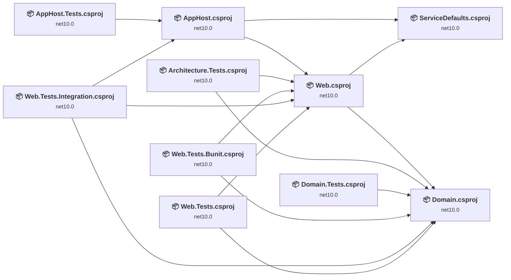

## Project Details

### MyBlog\src\AppHost\AppHost.csproj

#### Project Info

- **Current Target Framework:** net10.0
- **Proposed Target Framework:** net11.0
- **SDK-style**: True
- **Project Kind:** DotNetCoreApp
- **Dependencies**: 2
- **Dependants**: 2
- **Number of Files**: 2
- **Number of Files with Incidents**: 1
- **Lines of Code**: 406
- **Estimated LOC to modify**: 0+ (at least 0.0% of the project)

#### Dependency Graph

Legend:
📦 SDK-style project
⚙️ Classic project

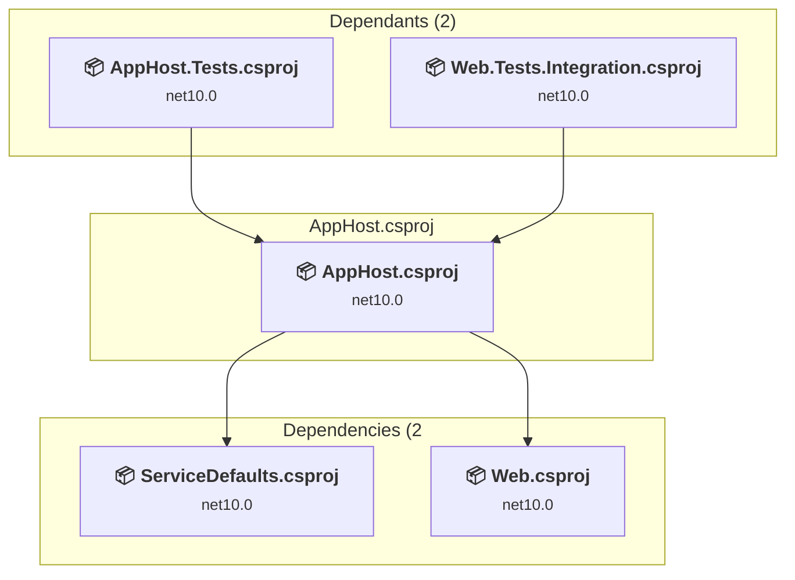

### API Compatibility

| Category | Count | Impact |
| :--- | :---: | :--- |
| 🔴 Binary Incompatible | 0 | High - Require code changes |
| 🟡 Source Incompatible | 0 | Medium - Needs re-compilation and potential conflicting API error fixing |
| 🔵 Behavioral change | 0 | Low - Behavioral changes that may require testing at runtime |
| ✅ Compatible | 596 |  |
| ***Total APIs Analyzed*** | ***596*** |  |

### MyBlog\src\Domain\Domain.csproj

#### Project Info

- **Current Target Framework:** net10.0
- **Proposed Target Framework:** net11.0
- **SDK-style**: True
- **Project Kind:** ClassLibrary
- **Dependencies**: 0
- **Dependants**: 6
- **Number of Files**: 6
- **Number of Files with Incidents**: 1
- **Lines of Code**: 326
- **Estimated LOC to modify**: 0+ (at least 0.0% of the project)

#### Dependency Graph

Legend:
📦 SDK-style project
⚙️ Classic project

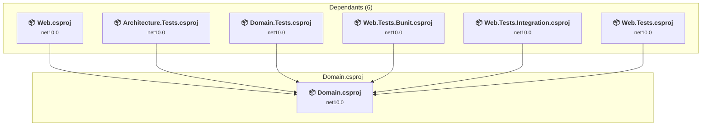

### API Compatibility

| Category | Count | Impact |
| :--- | :---: | :--- |
| 🔴 Binary Incompatible | 0 | High - Require code changes |
| 🟡 Source Incompatible | 0 | Medium - Needs re-compilation and potential conflicting API error fixing |
| 🔵 Behavioral change | 0 | Low - Behavioral changes that may require testing at runtime |
| ✅ Compatible | 254 |  |
| ***Total APIs Analyzed*** | ***254*** |  |

### MyBlog\src\ServiceDefaults\ServiceDefaults.csproj

#### Project Info

- **Current Target Framework:** net10.0
- **Proposed Target Framework:** net11.0
- **SDK-style**: True
- **Project Kind:** ClassLibrary
- **Dependencies**: 0
- **Dependants**: 2
- **Number of Files**: 2
- **Number of Files with Incidents**: 1
- **Lines of Code**: 143
- **Estimated LOC to modify**: 0+ (at least 0.0% of the project)

#### Dependency Graph

Legend:
📦 SDK-style project
⚙️ Classic project

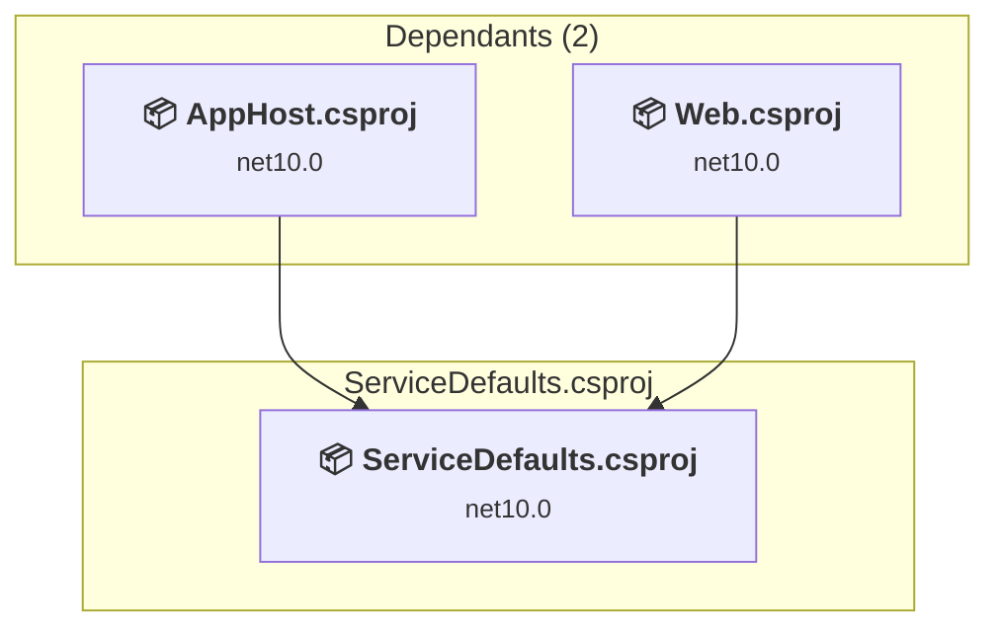

### API Compatibility

| Category | Count | Impact |
| :--- | :---: | :--- |
| 🔴 Binary Incompatible | 0 | High - Require code changes |
| 🟡 Source Incompatible | 0 | Medium - Needs re-compilation and potential conflicting API error fixing |
| 🔵 Behavioral change | 0 | Low - Behavioral changes that may require testing at runtime |
| ✅ Compatible | 138 |  |
| ***Total APIs Analyzed*** | ***138*** |  |

### MyBlog\src\Web\Web.csproj

#### Project Info

- **Current Target Framework:** net10.0
- **Proposed Target Framework:** net11.0
- **SDK-style**: True
- **Project Kind:** AspNetCore
- **Dependencies**: 2
- **Dependants**: 5
- **Number of Files**: 61
- **Number of Files with Incidents**: 7
- **Lines of Code**: 1813
- **Estimated LOC to modify**: 18+ (at least 1.0% of the project)

#### Dependency Graph

Legend:
📦 SDK-style project
⚙️ Classic project

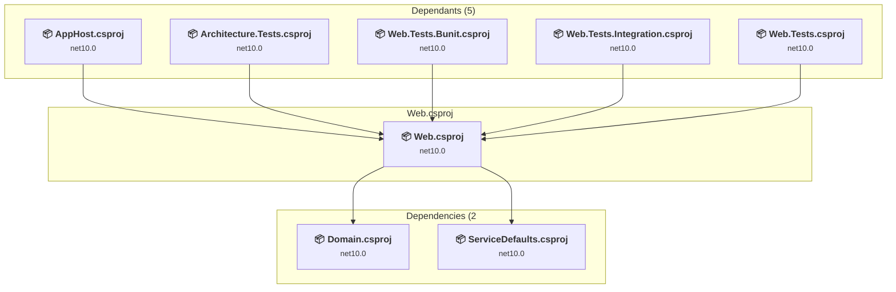

### API Compatibility

| Category | Count | Impact |
| :--- | :---: | :--- |
| 🔴 Binary Incompatible | 1 | High - Require code changes |
| 🟡 Source Incompatible | 8 | Medium - Needs re-compilation and potential conflicting API error fixing |
| 🔵 Behavioral change | 9 | Low - Behavioral changes that may require testing at runtime |
| ✅ Compatible | 4994 |  |
| ***Total APIs Analyzed*** | ***5012*** |  |

### MyBlog\tests\AppHost.Tests\AppHost.Tests.csproj

#### Project Info

- **Current Target Framework:** net10.0
- **Proposed Target Framework:** net11.0
- **SDK-style**: True
- **Project Kind:** DotNetCoreApp
- **Dependencies**: 1
- **Dependants**: 0
- **Number of Files**: 25
- **Number of Files with Incidents**: 5
- **Lines of Code**: 2751
- **Estimated LOC to modify**: 21+ (at least 0.8% of the project)

#### Dependency Graph

Legend:
📦 SDK-style project
⚙️ Classic project

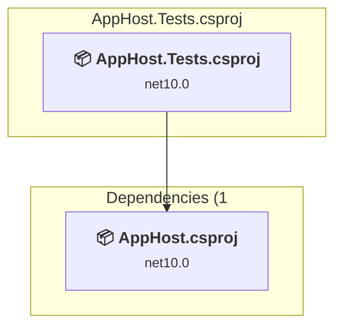

### API Compatibility

| Category | Count | Impact |
| :--- | :---: | :--- |
| 🔴 Binary Incompatible | 0 | High - Require code changes |
| 🟡 Source Incompatible | 6 | Medium - Needs re-compilation and potential conflicting API error fixing |
| 🔵 Behavioral change | 15 | Low - Behavioral changes that may require testing at runtime |
| ✅ Compatible | 2809 |  |
| ***Total APIs Analyzed*** | ***2830*** |  |

### MyBlog\tests\Architecture.Tests\Architecture.Tests.csproj

#### Project Info

- **Current Target Framework:** net10.0
- **Proposed Target Framework:** net11.0
- **SDK-style**: True
- **Project Kind:** DotNetCoreApp
- **Dependencies**: 2
- **Dependants**: 0
- **Number of Files**: 10
- **Number of Files with Incidents**: 1
- **Lines of Code**: 374
- **Estimated LOC to modify**: 0+ (at least 0.0% of the project)

#### Dependency Graph

Legend:
📦 SDK-style project
⚙️ Classic project

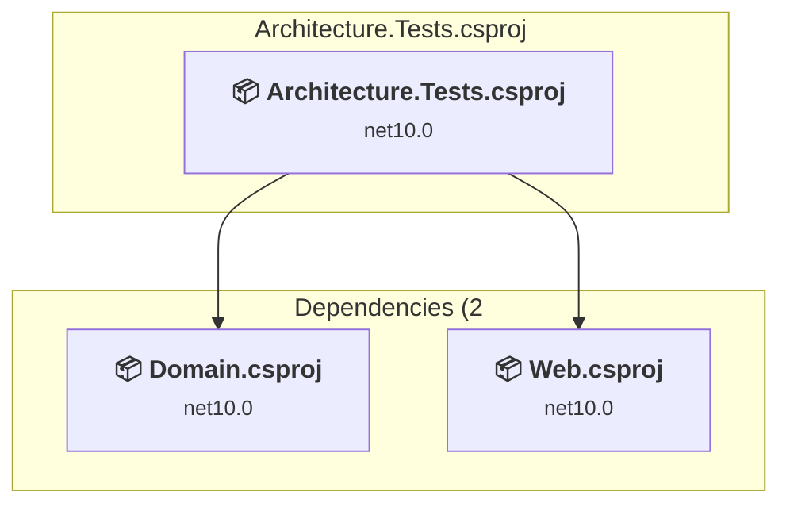

### API Compatibility

| Category | Count | Impact |
| :--- | :---: | :--- |
| 🔴 Binary Incompatible | 0 | High - Require code changes |
| 🟡 Source Incompatible | 0 | Medium - Needs re-compilation and potential conflicting API error fixing |
| 🔵 Behavioral change | 0 | Low - Behavioral changes that may require testing at runtime |
| ✅ Compatible | 405 |  |
| ***Total APIs Analyzed*** | ***405*** |  |

### MyBlog\tests\Domain.Tests\Domain.Tests.csproj

#### Project Info

- **Current Target Framework:** net10.0
- **Proposed Target Framework:** net11.0
- **SDK-style**: True
- **Project Kind:** DotNetCoreApp
- **Dependencies**: 1
- **Dependants**: 0
- **Number of Files**: 8
- **Number of Files with Incidents**: 1
- **Lines of Code**: 589
- **Estimated LOC to modify**: 0+ (at least 0.0% of the project)

#### Dependency Graph

Legend:
📦 SDK-style project
⚙️ Classic project

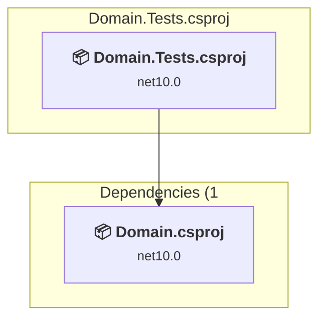

### API Compatibility

| Category | Count | Impact |
| :--- | :---: | :--- |
| 🔴 Binary Incompatible | 0 | High - Require code changes |
| 🟡 Source Incompatible | 0 | Medium - Needs re-compilation and potential conflicting API error fixing |
| 🔵 Behavioral change | 0 | Low - Behavioral changes that may require testing at runtime |
| ✅ Compatible | 724 |  |
| ***Total APIs Analyzed*** | ***724*** |  |

### MyBlog\tests\Web.Tests.Bunit\Web.Tests.Bunit.csproj

#### Project Info

- **Current Target Framework:** net10.0
- **Proposed Target Framework:** net11.0
- **SDK-style**: True
- **Project Kind:** DotNetCoreApp
- **Dependencies**: 2
- **Dependants**: 0
- **Number of Files**: 14
- **Number of Files with Incidents**: 1
- **Lines of Code**: 2302
- **Estimated LOC to modify**: 0+ (at least 0.0% of the project)

#### Dependency Graph

Legend:
📦 SDK-style project
⚙️ Classic project

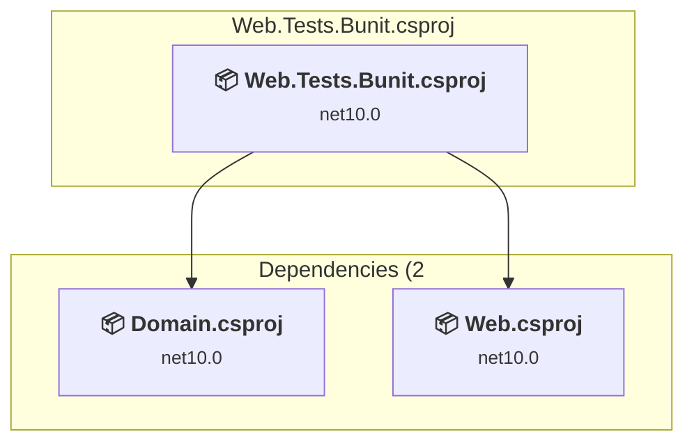

### API Compatibility

| Category | Count | Impact |
| :--- | :---: | :--- |
| 🔴 Binary Incompatible | 0 | High - Require code changes |
| 🟡 Source Incompatible | 0 | Medium - Needs re-compilation and potential conflicting API error fixing |
| 🔵 Behavioral change | 0 | Low - Behavioral changes that may require testing at runtime |
| ✅ Compatible | 4629 |  |
| ***Total APIs Analyzed*** | ***4629*** |  |

### MyBlog\tests\Web.Tests.Integration\Web.Tests.Integration.csproj

#### Project Info

- **Current Target Framework:** net10.0
- **Proposed Target Framework:** net11.0
- **SDK-style**: True
- **Project Kind:** DotNetCoreApp
- **Dependencies**: 3
- **Dependants**: 0
- **Number of Files**: 10
- **Number of Files with Incidents**: 1
- **Lines of Code**: 463
- **Estimated LOC to modify**: 0+ (at least 0.0% of the project)

#### Dependency Graph

Legend:
📦 SDK-style project
⚙️ Classic project

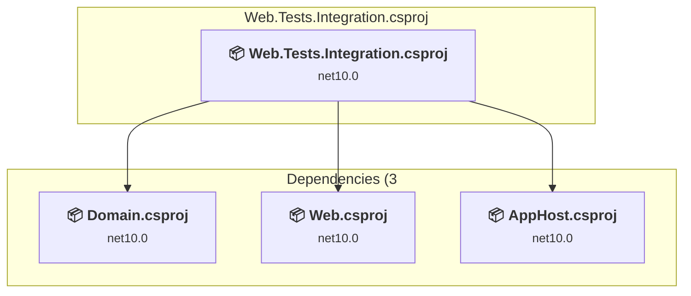

### API Compatibility

| Category | Count | Impact |
| :--- | :---: | :--- |
| 🔴 Binary Incompatible | 0 | High - Require code changes |
| 🟡 Source Incompatible | 0 | Medium - Needs re-compilation and potential conflicting API error fixing |
| 🔵 Behavioral change | 0 | Low - Behavioral changes that may require testing at runtime |
| ✅ Compatible | 573 |  |
| ***Total APIs Analyzed*** | ***573*** |  |

### MyBlog\tests\Web.Tests\Web.Tests.csproj

#### Project Info

- **Current Target Framework:** net10.0
- **Proposed Target Framework:** net11.0
- **SDK-style**: True
- **Project Kind:** DotNetCoreApp
- **Dependencies**: 2
- **Dependants**: 0
- **Number of Files**: 22
- **Number of Files with Incidents**: 3
- **Lines of Code**: 2986
- **Estimated LOC to modify**: 11+ (at least 0.4% of the project)

#### Dependency Graph

Legend:
📦 SDK-style project
⚙️ Classic project

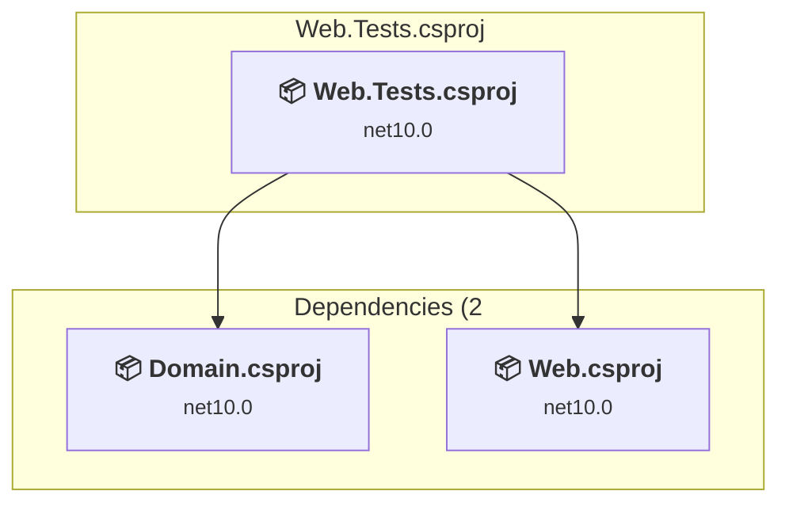

### API Compatibility

| Category | Count | Impact |
| :--- | :---: | :--- |
| 🔴 Binary Incompatible | 0 | High - Require code changes |
| 🟡 Source Incompatible | 1 | Medium - Needs re-compilation and potential conflicting API error fixing |
| 🔵 Behavioral change | 10 | Low - Behavioral changes that may require testing at runtime |
| ✅ Compatible | 4649 |  |
| ***Total APIs Analyzed*** | ***4660*** |  |
